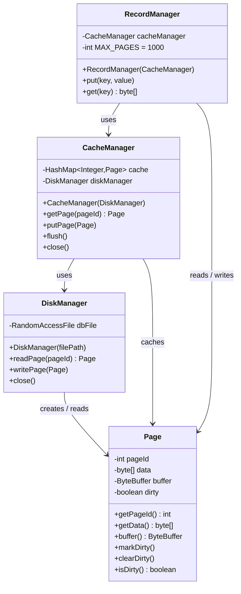
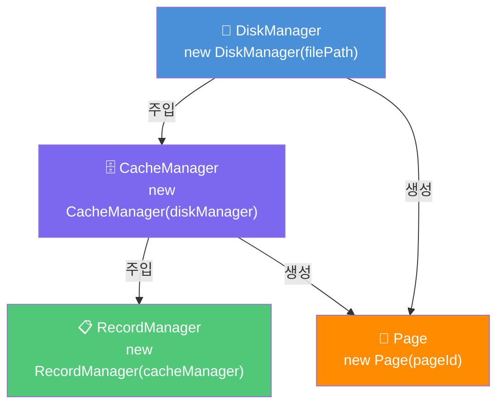
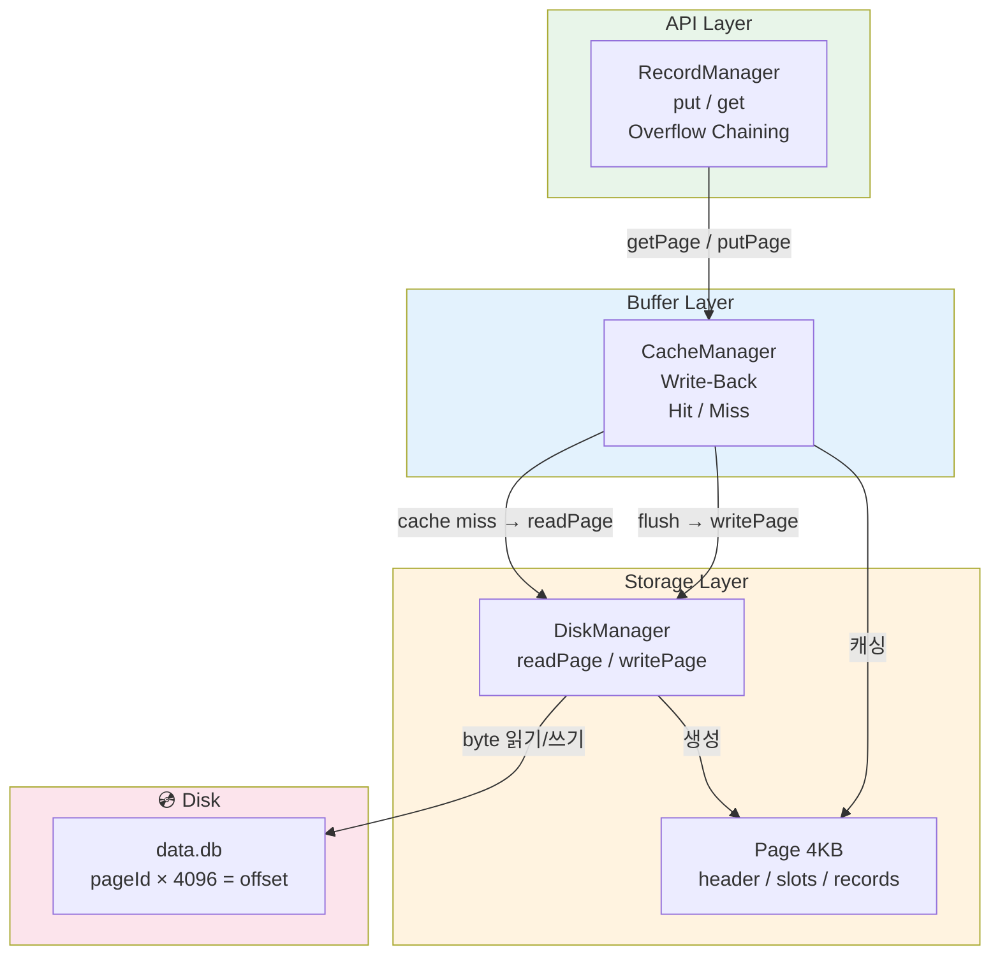
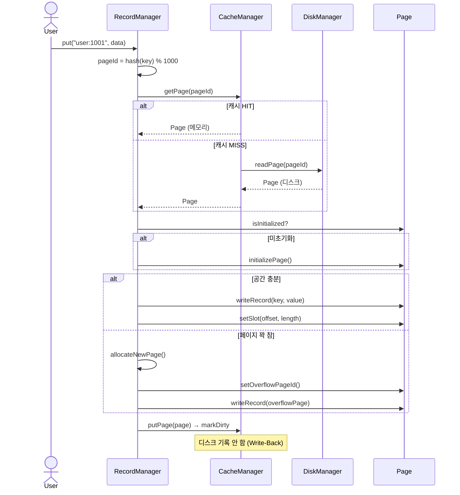
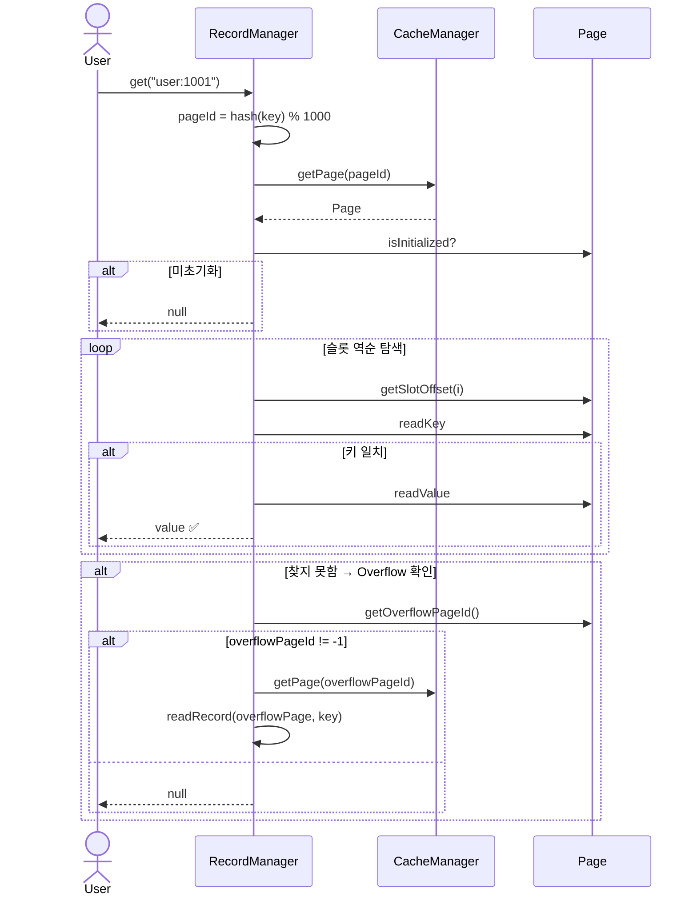
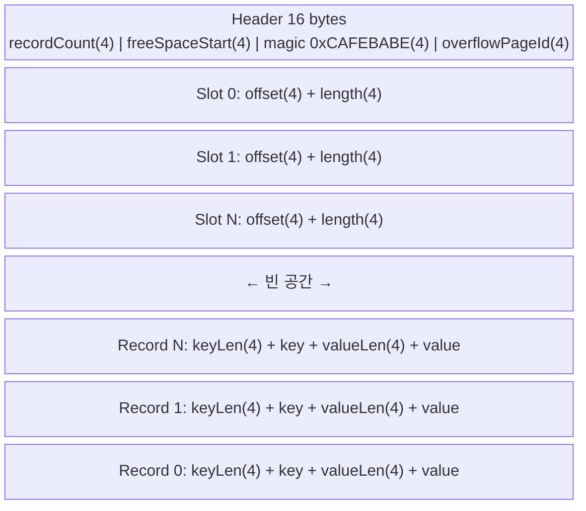
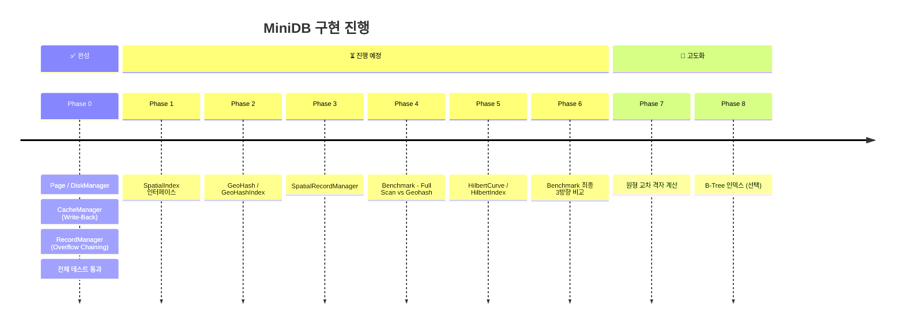

# MiniDB 아키텍처 다이어그램

## 클래스 의존성

```mermaid
classDiagram

    %% ─── Storage Layer ───
    class Page {
        -int pageId
        -byte[] data
        -ByteBuffer buffer
        -boolean dirty
        +getPageId() int
        +getData() byte[]
        +buffer() ByteBuffer
        +markDirty()
        +clearDirty()
        +isDirty() boolean
    }

    class DiskManager {
        -RandomAccessFile dbFile
        +DiskManager(filePath)
        +readPage(pageId) Page
        +writePage(Page)
        +close()
    }

    %% ─── Buffer Layer ───
    class CacheManager {
        -HashMap~Integer,Page~ cache
        -DiskManager diskManager
        +CacheManager(DiskManager)
        +getPage(pageId) Page
        +putPage(Page)
        +flush()
        +close()
    }

    %% ─── API Layer ───
    class RecordManager {
        -CacheManager cacheManager
        -int MAX_PAGES = 1000
        +RecordManager(CacheManager)
        +put(key, value)
        +get(key) byte[]
    }

    %% ─── 의존성 ───
    DiskManager --> Page : creates / reads
    CacheManager --> DiskManager : uses
    CacheManager --> Page : caches
    RecordManager --> CacheManager : uses
    RecordManager --> Page : reads / writes
```

---

## 객체 생성 및 의존성 주입 흐름

```mermaid
flowchart TD
    A["📁 DiskManager\n new DiskManager(filePath)"]
    B["🗄️ CacheManager\n new CacheManager(diskManager)"]
    C["📋 RecordManager\n new RecordManager(cacheManager)"]
    D["💾 Page\n new Page(pageId)"]

    A -->|주입| B
    B -->|주입| C
    B -->|생성| D
    A -->|생성| D

    style A fill:#4a90d9,color:#fff
    style B fill:#7b68ee,color:#fff
    style C fill:#50c878,color:#fff
    style D fill:#ff8c00,color:#fff
```

---

## 레이어 구조

```mermaid
flowchart TB
    subgraph API["API Layer"]
        RM["RecordManager\nput / get\nOverflow Chaining"]
    end

    subgraph Buffer["Buffer Layer"]
        CM["CacheManager\nWrite-Back\nHit / Miss"]
    end

    subgraph Storage["Storage Layer"]
        DM["DiskManager\nreadPage / writePage"]
        PG["Page 4KB\nheader / slots / records"]
    end

    subgraph Disk["💿 Disk"]
        DB["data.db\npageId × 4096 = offset"]
    end

    RM -->|getPage / putPage| CM
    CM -->|cache miss → readPage| DM
    CM -->|flush → writePage| DM
    DM -->|byte 읽기/쓰기| DB
    DM -->|생성| PG
    CM -->|캐싱| PG

    style API fill:#e8f5e9
    style Buffer fill:#e3f2fd
    style Storage fill:#fff3e0
    style Disk fill:#fce4ec
```

---

## 데이터 흐름: put(key, value)

```mermaid
sequenceDiagram
    actor User
    participant RM as RecordManager
    participant CM as CacheManager
    participant DM as DiskManager
    participant PG as Page

    User->>RM: put("user:1001", data)
    RM->>RM: pageId = hash(key) % 1000
    RM->>CM: getPage(pageId)

    alt 캐시 HIT
        CM-->>RM: Page (메모리)
    else 캐시 MISS
        CM->>DM: readPage(pageId)
        DM-->>CM: Page (디스크)
        CM-->>RM: Page
    end

    RM->>PG: isInitialized?
    alt 미초기화
        RM->>PG: initializePage()
    end

    alt 공간 충분
        RM->>PG: writeRecord(key, value)
        RM->>PG: setSlot(offset, length)
    else 페이지 꽉 참
        RM->>RM: allocateNewPage()
        RM->>PG: setOverflowPageId()
        RM->>PG: writeRecord(overflowPage)
    end

    RM->>CM: putPage(page) → markDirty
    Note over CM: 디스크 기록 안 함 (Write-Back)
```

---

## 데이터 흐름: get(key)

```mermaid
sequenceDiagram
    actor User
    participant RM as RecordManager
    participant CM as CacheManager
    participant PG as Page

    User->>RM: get("user:1001")
    RM->>RM: pageId = hash(key) % 1000
    RM->>CM: getPage(pageId)
    CM-->>RM: Page

    RM->>PG: isInitialized?
    alt 미초기화
        RM-->>User: null
    end

    loop 슬롯 역순 탐색
        RM->>PG: getSlotOffset(i)
        RM->>PG: readKey
        alt 키 일치
            RM->>PG: readValue
            RM-->>User: value ✅
        end
    end

    alt 찾지 못함 → Overflow 확인
        RM->>PG: getOverflowPageId()
        alt overflowPageId != -1
            RM->>CM: getPage(overflowPageId)
            RM->>RM: readRecord(overflowPage, key)
        else
            RM-->>User: null
        end
    end
```

---

## Page 내부 구조

```mermaid
block-beta
    columns 1
    A["Header 16 bytes\nrecordCount(4) | freeSpaceStart(4) | magic 0xCAFEBABE(4) | overflowPageId(4)"]
    B["Slot 0: offset(4) + length(4)"]
    C["Slot 1: offset(4) + length(4)"]
    D["Slot N: offset(4) + length(4)"]
    E["← 빈 공간 →"]
    F["Record N: keyLen(4) + key + valueLen(4) + value"]
    G["Record 1: keyLen(4) + key + valueLen(4) + value"]
    H["Record 0: keyLen(4) + key + valueLen(4) + value"]
```

---

## 로드맵 진행 현황

```mermaid
timeline
    title MiniDB 구현 진행
    section ✅ 완성
        Phase 0 : Page / DiskManager
                : CacheManager (Write-Back)
                : RecordManager (Overflow Chaining)
                : 전체 테스트 통과
    section ⏳ 진행 예정
        Phase 1 : SpatialIndex 인터페이스
        Phase 2 : GeoHash / GeoHashIndex
        Phase 3 : SpatialRecordManager
        Phase 4 : Benchmark - Full Scan vs Geohash
        Phase 5 : HilbertCurve / HilbertIndex
        Phase 6 : Benchmark 최종 3방향 비교
    section 🔮 고도화
        Phase 7 : 원형 교차 격자 계산
        Phase 8 : B-Tree 인덱스 (선택)
```
