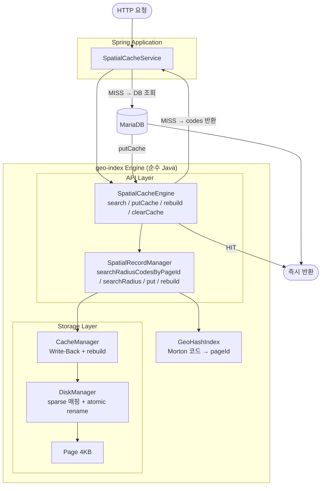

# MiniDB — Spatial Page Cache Engine

> **위치 기반 병원 검색에서 반경 쿼리는 동일 지역 요청이 반복되는 특성이 있다.**
> 하지만 기존 구조는 매번 DB를 조회한다.
>
> → Spatial Index로 좌표를 pageId로 클러스터링
> → pageId 단위 JVM Cache로 DB 접근 제거
> → 외부 인프라(Redis) 없이 서비스 내 메모리만으로 해결

---

## 배경

위치 기반 병원 검색 서비스에서 반경 기반 거리 조회(Radius Query) 성능 저하 문제를 경험했습니다.

```
문제 1: MariaDB SPATIAL INDEX
  서비스 환경의 쿼리 패턴에서 MBRContains 공간 연산 오버헤드로
  기대만큼의 성능 개선을 얻지 못함 (30–50ms)

문제 2: Redis Geohash 캐싱
  외부 인프라 의존성 + 네트워크 왕복 지연 (29–124ms)

해결: 커스텀 Geohash 공간 인덱스 엔진 (MiniDB) 직접 구현
  → 반경 검색 후보 98.3% 감소 (79,081건 → 1,366건)
  → JVM 캐시 결합 시 최대 46.8x 성능 개선
```

---

## 아키텍처



---

## 핵심 설계

### Storage 레이어

```
Page (4KB) → DiskManager (sparse 매핑 테이블) → CacheManager (Write-Back)

pageId가 6천만이어도 실제 파일 = 데이터 페이지 수 × 4KB
→ Morton 코드를 직접 pageId로 사용 가능
```

### GeoHash 인덱스 (Morton 코드 직접 사용)

3단계 설계 개선을 거쳐 현재 구조에 도달했습니다:

```
1차: steps × steps 고정 셀 → 반경 경계 누락
2차: % MAX_PAGES 매핑 → % 연산으로 공간 지역성 파괴
3차: Morton SHIFT → 한국 좌표 특성상 pageId 1~2개로 뭉침
4차: Morton 직접 pageId + sparse 매핑 테이블 → 187개 분산 ✅
```

→ 설계 개선 상세 기록: [GEOHASH_IMPLEMENTATION.md](./geo-index/src/main/java/geoindex/index/GEOHASH_IMPLEMENTATION.md)

### Hilbert Multi-Interval Query

```
① 반경 안 격자(x, y) 순회
② 각 격자 → 힐버트값 → pageId 마킹
③ pageId 연속 구간 → Interval Merge
④ disjoint interval별 pageId 범위만 읽기
```

힐버트 곡선 위 interval 분포 (강남 반경 5km):
```
[3766], [3772~3773], [3775], [3879~3884], [3889~3890]
→ 5개 disjoint interval, pageId 12개만 I/O
```

### JVM 캐시 + rebuild()

```
첫 요청:
  MiniDB → pageId 목록 반환 (0ms)
  pageId별 캐시 확인 → MISS
  MariaDB → 전체 데이터 조회
  결과 → putCache() → JVM 캐시 저장

두 번째 요청 (같은 반경):
  MiniDB → pageId 목록 반환 (0ms)
  pageId별 캐시 확인 → HIT
  MariaDB 왕복 없음 → 즉시 반환
```

배치 업데이트 시:
```
spatialRecordManager.rebuild(srm ->
    hospitalRepo.findAllCodes().forEach(h ->
        srm.put(h.getLat(), h.getLng(), h.getCode().getBytes())
    )
);
→ atomic rename으로 기존 파일 교체 + JVM 캐시 초기화
→ 요청 중단 없음
```

---

## 성능 결과

### 더미 데이터 벤치마크 (1,000회 평균)

> 측정 조건: JVM Warm-up 후 동일 쿼리 1,000회 평균 / 각 실행 전 캐시 초기화

<div align=center>

</div>

- **Full Scan**: 데이터량에 따라 선형 증가 O(N)
- **GeoHash**: 공간 밀도에 의존 O(P) → 대규모 데이터에서도 일정한 검색 성능 유지
- **Hilbert**: Multi-Interval Query로 필요한 pageId만 정확히 탐색

### 실서비스 벤치마크 (실제 한국 병원 79,081건)

> 측정 조건: Warm-up 5회 제외 / 홀짝 교대 실행으로 캐시 편향 제거 / 3종 시나리오 100회

<div align=center>

</div>

**GeoIndex 단독이 Full Scan과 유사한 이유:**

```
79,081건은 MariaDB 버퍼풀에 전부 상주 → 두 방식 모두 메모리 스캔
IN (1,366건) 쿼리 오버헤드 ≈ BETWEEN 범위 스캔 비용

→ GeoIndex의 실제 역할 = 후보 감소가 아니라 pageId 단위 캐시 키 제공
```

**데이터가 폭증할 경우 GeoHash가 빛을 발한다:**

```
10만 건  → Full Scan 528ms  / GeoHash  7ms  →  75배
100만 건 → Full Scan 1177ms / GeoHash  6ms  → 118배

→ 데이터가 버퍼풀을 초과하는 순간 디스크 I/O 차이가 폭발적으로 벌어짐
```

**시나리오별 해석:**

```
Random (Worst Case):    완전 랜덤 좌표 = 캐시 재사용 불가 → HIT  5.8% →  1.2x
Mixed  (현실적 서비스):  70% 핫스팟     → HIT 95.9%        → 24.6x
Hotspot (Best Case):    서울 주요 지역 순환 → HIT 98.6%    → 46.8x
```

---

## Production Integration

MiniDB는 트랜잭션 및 동시성 제어를 지원하지 않으므로 Primary Database 대체가 아닌 **공간 필터 + JVM 캐시** 역할로 사용합니다.

```
[요청]
  ↓
[MiniDB] pageId 목록 계산 (0ms)
  ↓
[SpatialCacheService] pageId 캐시 확인
  ├─ HIT → 즉시 반환 (MariaDB 왕복 없음)
  └─ MISS → [MariaDB] WHERE hospital_code IN (...) + JOIN
              → 결과를 pageId 단위로 캐시 저장
```

**운영 전략:**
```
병원 데이터는 주 1회 대량 배치 업데이트
→ 매주 MiniDB 전체 재빌드 (delete 불필요)
→ 재빌드 중 이전 파일로 서비스 유지 (atomic rename)
→ 완료 후 파일 교체 + JVM 캐시 자동 초기화
```

### Spring MVC 연동

순수 Spring MVC 프로젝트에 Maven 로컬 빌드로 연동하여 검증했습니다.

```bash
# geo-index 엔진 로컬 빌드
mvn install
```

```xml
<!-- Spring MVC 프로젝트 pom.xml -->
<dependency>
    <groupId>geoindex</groupId>
    <artifactId>geo-index</artifactId>
    <version>1.0-SNAPSHOT</version>
</dependency>
```

```java
// GeoIndexConfig — Storage / Buffer / API 레이어 빈 등록
@Bean public DiskManager diskManager() { ... }
@Bean public CacheManager cacheManager() { ... }
@Bean public SpatialRecordManager spatialRecordManager() { ... }

// SpatialCacheService — 엔진 호출
spatialCacheEngine.search(lat, lng, radiusKm);    // HIT/MISS 판단
spatialCacheEngine.putCache(pageId, dbResults);   // MISS 후 캐시 저장
```

위 성능 수치는 이 연동 환경에서 실제 한국 병원 데이터 79,081건으로 측정한 결과입니다.

---

## 핵심 인사이트

```
Spatial Index 자체는 DB 쿼리 성능을 크게 개선하지 않을 수 있다.

실제 서비스에서 MariaDB 버퍼풀이 데이터를 메모리에 상주시키면
Full Scan과 GeoIndex의 DB 조회 시간 차이는 크지 않다.

하지만 Spatial Index가 제공하는 pageId는
"같은 지역 = 같은 pageId"라는 캐시 키가 된다.

pageId 단위로 캐시하면 DB 접근 자체를 제거할 수 있다.
→ DB 쿼리를 빠르게 만드는 것이 아니라, DB를 아예 안 보는 것.
```

---

## 동시성 이슈 해결

### 왜 이 엔진은 동시성이 특히 중요한가

```
일반 캐시:
  잘못된 캐시 → TTL 만료 후 자동 복구 ✅

이 엔진:
  put() → pageId 계산 → Page에 영구 기록
  한번 잘못 기록된 Page = rebuild() 전까지 영원히 틀린 결과
  데이터 정확성 = 생명
```

### 해결한 버그

| # | 버그 | 원인 | 해결 기법 |
|---|------|------|----------|
| 1 | ByteBuffer position 공유 → `BufferUnderflowException` | `position()` 상태 공유 | 절대 위치 메서드 교체 |
| 2 | Page 객체 중복 생성 → 데이터 유실 | check-then-act 비원자성 | `computeIfAbsent` |
| 3 | read/write 동시 접근 → GeoIndex 결과 누락 | 중간 상태 노출 | `ReentrantReadWriteLock` |
| 4 | overflow pageId 중복 할당 → 데이터 덮어씀 | `ArrayDeque` thread-unsafe | `ConcurrentLinkedDeque` |
| 5 | `DiskManager.readPage()` seek/read race → 잘못된 데이터 반환 | `RandomAccessFile` 파일 포인터 공유 | `synchronized` |
| 6 | `DiskManager.writePage()` 복합 race → 데이터 손상 | `HashMap`, `nextDataOffset`, `entryCount` 비원자성 | `synchronized` |
| 7 | `Page.dirty` visibility 문제 → flush 누락 | `volatile` 미선언 | `volatile boolean dirty` |
| 8 | `CacheManager.flush()` dirty flag race → 변경사항 유실 | isDirty-writePage-clearDirty 비원자성 | `synchronized(page)` |
| 9 | `PageCacheStore.put()` maxSize 초과 | size 체크와 put 사이 race | `synchronized` |

**근본 원인:**

```
SpatialRecordManager (Page 레벨 락 ✅)
        ↓
  CacheManager        (flush 동기화 ❌ → Bug 8)
        ↓
  DiskManager         (RandomAccessFile 동기화 ❌ → Bug 5, 6)
```

상위 계층의 락이 하위 계층의 thread-safety를 보장하지 않는다. 계층 전체를 독립적으로 보호해야 한다.

### 검증 방법론 — compare 엔드포인트

동시성 버그는 단독 스레드에서는 재현되지 않는다. 다음 방식으로 검증했다.

```
GET /loadtest/compare?lat=&lng=&radius=

동일 좌표로 FullScan / GeoIndex 동시 호출
→ 결과를 hospital_code Set으로 비교
→ 누락 건수 로그 출력

스레드 1   → 재현 안 되면 로직 버그
스레드 500 → 재현되면 동시성 버그 확정
```

### 검증 결과 (스레드 500 동시)

```
수정 전:
  FullScan 5040건 | GeoIndex 4610건 | 누락 430건 ❌

수정 후:
  비교 lat=37.5263327 lng=127.0274689
  FullScan: 6460건 | GeoIndex: 6460건 | 누락: 0건 ✅

  전체 100건 비교 → 동시성으로 인한 누락 0건 ✅
```

→ 상세 내용: [CONCURRENCY.md](./CONCURRENCY.md)

---

## 모듈 구조

```
geo-index/
  storage/
    Page.java               4KB 페이지
    DiskManager.java        sparse 매핑 테이블 + atomic rename rebuild
    PageLayout.java         슬롯 페이지 구조 (절대 위치 읽기/쓰기)
  buffer/
    CacheManager.java       Write-Back 캐싱 + rebuild + computeIfAbsent
  api/
    SpatialCacheEngine.java     최상단 API — JVM 캐시 (getOrMiss / put / clearCache)
    SpatialRecordManager.java   파일 검색 / 저장 / rebuild
    PageResult.java             캐시 조회 결과 값 객체
    RecordId.java               레코드 물리 위치 값 객체 (pageId + slotId)
    RecordManager.java          Key-Value 저장
  cache/
    PageCacheStore.java         ConcurrentHashMap 기반 캐시 인프라
    CachePolicy.java            TTL / maxSize 정책
    CacheEntry.java             캐시 값 래퍼 (데이터 + 만료시각)
  index/
    SpatialIndex.java       인터페이스
    GeoHash.java            Morton 코드 인코딩 (toMorton / interleave)
    GeoHashIndex.java       Morton 직접 pageId 매핑
    HilbertCurve.java       힐버트 곡선 계산
    HilbertIndex.java       Multi-Interval Query 구현
    HilbertIndexDebug.java  힐버트 인덱스 디버그 유틸
  benchmark/
    FullScanBenchmark.java
    GeoHashBenchmark.java
    HilbertBenchmark.java
    BenchmarkRunner.java
  util/
    GeoUtils.java           Haversine 거리 계산
```

---

## 기술 스택

| 항목 | 내용 |
|------|------|
| **언어** | Java 21 |
| **스토리지** | RandomAccessFile (페이지 기반) |
| **외부 의존성** | 없음 (Framework 없이 순수 Java) |
| **테스트** | JUnit 5 |
| **데이터** | 79,081건 한국 병원 데이터 |
| **시각화** | Python (folium, matplotlib) |

---

## 로드맵

```
✅ Phase 1: Storage (Page, DiskManager, CacheManager)
✅ Phase 2: API (RecordManager, PageLayout)
✅ Phase 3: GeoHash (GeoHash, GeoHashIndex, SpatialRecordManager)
✅ Phase 4: Benchmark (Full Scan vs GeoHash vs Hilbert)
✅ Phase 5: Hilbert Multi-Interval Query + Seek Count 비교
✅ Phase 6: DiskManager sparse 매핑 테이블
✅ Phase 7: Morton 코드 직접 pageId 매핑 (pageId 분산 187개)
✅ Phase 8: 실제 병원 데이터 연동 + A/B 벤치마크 (50회 평균)
✅ Phase 9: SpatialCacheService (JVM 캐시) + 3종 시나리오 벤치마크
    - Map<pageId, List<HospitalData>> Lazy 캐시
    - pageId 전체 저장 + MBR 필터링으로 누락/초과 방지
    - Random / Mixed / Hotspot 100회 시나리오 측정
    - Mixed 24.6x / Hotspot 46.8x 개선 확인
✅ Phase 10: 캐시 운영 고도화
    - CachePolicy (TTL / maxSize), CacheEntry (만료시각 래퍼)
    - SpatialCacheEngine 리팩토링 (SpatialRecordManager 의존성 제거)
    - SpatialRecordManager 최상단 API 통합 (search / putCache / rebuild)
    - atomic rename 기반 무중단 rebuild
    - SpatialCache<T> 인터페이스 제거 (단순화)
✅ Phase 11: 동시성 이슈 해결 (Bug 1~4)
    - ByteBuffer position() → 절대 위치 메서드 교체 (BufferUnderflowException 제거)
    - CacheManager.getPage() → computeIfAbsent (Page 객체 중복 생성 방지)
    - writeWithOverflow() / readAllCodesFromChain() → ReentrantReadWriteLock 읽기/쓰기 분리 (누락 방지)
    - overflowFreeList → ConcurrentLinkedDeque (중복 pageId 할당 방지)
    - 스레드 500 동시 요청 검증: 동시성으로 인한 누락 0건 확인
✅ Phase 12: GeoHash 경계값 오버플로우 수정
    - getPageIds() maxLatBits/maxLngBits → Math.min((1L<<15)-1, ...) 클램핑
    - 극좌표 근처 좌표 검색 시 페이지 누락 방지
✅ Phase 13: 하위 계층 동시성 이슈 해결 (Bug 5~9)
    - DiskManager.readPage() / writePage() → synchronized (RandomAccessFile race 해결)
    - Page.dirty → volatile (스레드 간 visibility 보장)
    - CacheManager.flush() → synchronized(page) (dirty flag race 해결)
    - PageCacheStore.put() → synchronized (maxSize race 해결)
    - 스레드 500 동시 요청 검증: 데이터 누락 0건 확인
```

---

## 라이센스

MIT