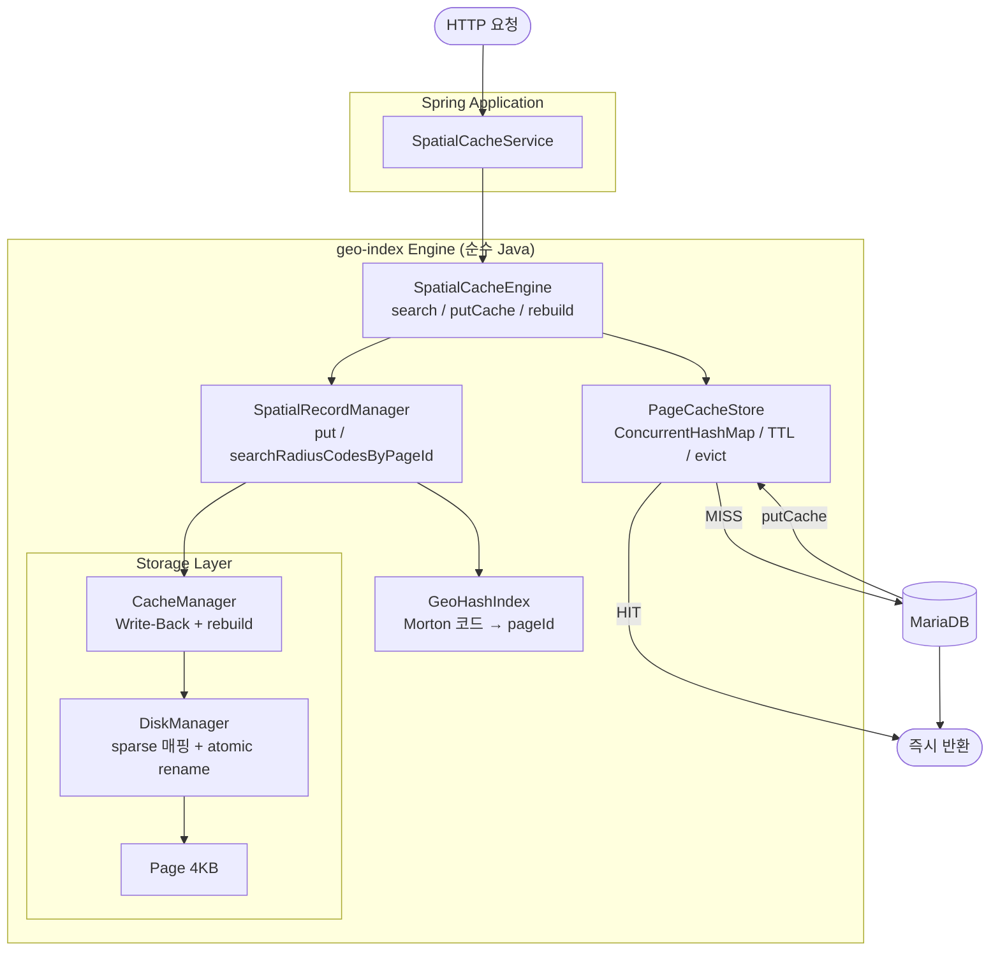

# MiniDB — Spatial Page Cache Engine

> **위치 기반 병원 검색에서 반경 쿼리는 동일 지역 요청이 반복되는 특성이 있다.**
> 하지만 기존 구조는 매번 DB를 조회한다.
>
> → Spatial Index로 좌표를 pageId로 클러스터링
> → pageId 단위 JVM Cache로 DB 접근 제거
> → 외부 인프라(Redis) 없이 서비스 내 메모리만으로 해결

---

## 배경

위치 기반 병원 검색 서비스에서 반경 기반 거리 조회(Radius Query) 성능 저하 문제를 경험했습니다.

```
문제 1: MariaDB SPATIAL INDEX
  서비스 환경의 쿼리 패턴에서 MBRContains 공간 연산 오버헤드로
  기대만큼의 성능 개선을 얻지 못함 (30–50ms)

문제 2: Redis Geohash 캐싱
  외부 인프라 의존성 + 네트워크 왕복 지연 (29–124ms)

해결: 커스텀 Geohash 공간 인덱스 엔진 (MiniDB) 직접 구현
  → 반경 검색 후보 98.3% 감소 (79,081건 → 1,366건)
  → JVM 캐시 결합 시 최대 46.8x 성능 개선
```

---

## 아키텍처



---

## 핵심 설계

### Storage 레이어

```
Page (4KB) → DiskManager (sparse 매핑 테이블) → CacheManager (Write-Back)

pageId가 6천만이어도 실제 파일 = 데이터 페이지 수 × 4KB
→ Morton 코드를 직접 pageId로 사용 가능
```

### GeoHash 인덱스 (Morton 코드 직접 사용)

3단계 설계 개선을 거쳐 현재 구조에 도달했습니다:

```
1차: steps × steps 고정 셀 → 반경 경계 누락
2차: % MAX_PAGES 매핑 → % 연산으로 공간 지역성 파괴
3차: Morton SHIFT → 한국 좌표 특성상 pageId 1~2개로 뭉침
4차: Morton 직접 pageId + sparse 매핑 테이블 → 187개 분산 ✅
```

→ 설계 개선 상세 기록: [GEOHASH_IMPLEMENTATION.md](./geo-index/src/main/java/geoindex/index/GEOHASH_IMPLEMENTATION.md)

### Hilbert Multi-Interval Query

```
① 반경 안 격자(x, y) 순회
② 각 격자 → 힐버트값 → pageId 마킹
③ pageId 연속 구간 → Interval Merge
④ disjoint interval별 pageId 범위만 읽기
```

힐버트 곡선 위 interval 분포 (강남 반경 5km):
```
[3766], [3772~3773], [3775], [3879~3884], [3889~3890]
→ 5개 disjoint interval, pageId 12개만 I/O
```

→ 설계 개선 상세 기록: [HILBERT_IMPLEMENTATION.md](./geo-index/src/main/java/geoindex/index/HILBERT_IMPLEMENTATION.md)

### JVM 캐시 + rebuild()

```
실제 서비스에서 MariaDB 버퍼풀이 데이터를 메모리에 상주시키면
Full Scan과 GeoIndex의 DB 조회 시간 차이는 크지 않다.

하지만 Spatial Index가 제공하는 pageId는
"같은 지역 = 같은 pageId"라는 캐시 키가 된다.

pageId 단위로 캐시하면 DB 접근 자체를 제거할 수 있다.
→ DB 쿼리를 빠르게 만드는 것이 아니라, DB를 아예 안 보는 것.
```

배치 업데이트 시:
```java
spatialCacheEngine.rebuild(srm ->
    hospitalRepo.findAllCodes().forEach(h ->
        srm.put(h.getLat(), h.getLng(), h.getCode().getBytes())
    )
);
// atomic rename으로 기존 파일 교체 + JVM 캐시 초기화
// 요청 중단 없음
```

---

## 성능 결과

### 더미 데이터 벤치마크 (규모별 성능 추세)

> 측정 조건: 동일 쿼리 1,000회 평균 / 각 실행 전 캐시 초기화

<div align=center>

</div>

| 건수 | Full Scan | GeoHash | Hilbert |
|------|----------|---------|---------|
| 10,000 | 100ms | < 1ms | 29ms |
| 20,000 | 133ms | < 1ms | 33ms |
| 30,000 | 259ms | 2ms | 32ms |
| 50,000 | 292ms | < 1ms | 33ms |
| 79,081 | 434ms | < 1ms | 33ms |
| 100,000 | 528ms | < 1ms | 47ms |
| 200,000 | 660ms | 3ms | 24ms |
| 500,000 | 768ms | < 1ms | 24ms |
| 1,000,000 | 1,177ms | 6ms | 34ms |

- **Full Scan**: 데이터량에 따라 선형 증가 O(N)
- **GeoHash**: 공간 밀도에 의존 O(P) → 대규모 데이터에서도 일정한 검색 성능 유지
- **Hilbert**: Multi-Interval Query로 필요한 pageId만 정확히 탐색

### 실서비스 벤치마크 (실제 한국 병원 79,081건)

> 측정 조건: Warm-up 5회 제외 / 홀짝 교대 실행으로 캐시 편향 제거 / 3종 시나리오 100회

<div align=center>

</div>

**GeoIndex 단독이 Full Scan과 유사한 이유:**

```
79,081건은 MariaDB 버퍼풀에 전부 상주 → 두 방식 모두 메모리 스캔
IN (1,366건) 쿼리 오버헤드 ≈ BETWEEN 범위 스캔 비용

→ GeoIndex의 실제 역할 = 후보 감소가 아니라 pageId 단위 캐시 키 제공
```

**데이터가 폭증할 경우 GeoHash가 빛을 발한다:**

```
10만 건  → Full Scan 528ms  / GeoHash  7ms  →  75배
100만 건 → Full Scan 1177ms / GeoHash  6ms  → 118배

→ 데이터가 버퍼풀을 초과하는 순간 디스크 I/O 차이가 폭발적으로 벌어짐
```

**시나리오별 해석:**

| 시나리오 | 개선율 | HIT율 | 특징 |
|----------|--------|-------|------|
| Random | 1.2x | 5.8% | Worst Case (캐시 재사용 없음) |
| **Mixed** | **24.6x** | **95.9%** | **현실적 서비스 트래픽** |
| Hotspot | 46.8x | 98.6% | Best Case (인기 지역 순환) |

```
Random (Worst Case):    완전 랜덤 좌표 = 캐시 재사용 불가 → HIT  5.8% →  1.2x
Mixed  (현실적 서비스):  70% 핫스팟     → HIT 95.9%        → 24.6x
Hotspot (Best Case):    서울 주요 지역 순환 → HIT 98.6%    → 46.8x
```

---

## Production Integration

MiniDB는 트랜잭션 및 동시성 제어를 지원하지 않으므로 Primary Database 대체가 아닌 **공간 필터 + JVM 캐시** 역할로 사용합니다.

```
[요청]
  ↓
[MiniDB] pageId 목록 계산 (0ms)
  ↓
[SpatialCacheEngine] pageId 캐시 확인
  ├─ HIT → 즉시 반환 (MariaDB 왕복 없음)
  └─ MISS → [MariaDB] WHERE hospital_code IN (...) + JOIN
              → 결과를 pageId 단위로 캐시 저장
```

**운영 전략:**
```
병원 데이터는 주 1회 대량 배치 업데이트
→ 매주 MiniDB 전체 재빌드 (delete 불필요)
→ 재빌드 중 이전 파일로 서비스 유지 (atomic rename)
→ 완료 후 파일 교체 + JVM 캐시 자동 초기화
```

---

## 모듈 구조

```
geo-index/
  storage/
    Page.java               4KB 페이지
    DiskManager.java        sparse 매핑 테이블 + atomic rename rebuild
    PageLayout.java         슬롯 페이지 구조
  buffer/
    CacheManager.java       Write-Back 캐싱 + rebuild
  api/
    SpatialCacheEngine.java     최상단 API (search / putCache / rebuild / clearCache)
    SpatialRecordManager.java   파일 I/O 전담 (put / searchRadiusCodesByPageId / rebuild)
    RecordManager.java          Key-Value 저장
    PageResult.java             캐시 조회 결과 값 객체
    RecordId.java               O(1) 직접 접근 값 객체
  cache/
    PageCacheStore.java     JVM 캐시 인프라 (ConcurrentHashMap / TTL / evict)
    CachePolicy.java        TTL / maxSize 정책
    CacheEntry.java         캐시 값 래퍼 (데이터 + 만료시각)
  index/
    SpatialIndex.java       인터페이스
    GeoHash.java            Morton 코드 인코딩/디코딩
    GeoHashIndex.java       Morton 직접 pageId 매핑
    HilbertCurve.java       힐버트 곡선 계산
    HilbertIndex.java       Multi-Interval Query 구현
  benchmark/
    FullScanBenchmark.java
    GeoHashBenchmark.java
    HilbertBenchmark.java
    BenchmarkRunner.java
  util/
    GeoUtils.java           Haversine 거리 계산
```

---

## 기술 스택

| 항목 | 내용 |
|------|------|
| **언어** | Java 21 |
| **스토리지** | RandomAccessFile (페이지 기반) |
| **외부 의존성** | 없음 (Framework 없이 순수 Java) |
| **테스트** | JUnit 5 |
| **데이터** | 79,081건 한국 병원 데이터 |
| **시각화** | Python (folium, matplotlib) |

---

## 핵심 인사이트

```
Spatial Index 자체는 DB 쿼리 성능을 크게 개선하지 않을 수 있다.

실제 서비스에서 MariaDB 버퍼풀이 데이터를 메모리에 상주시키면
Full Scan과 GeoIndex의 DB 조회 시간 차이는 크지 않다.

하지만 Spatial Index가 제공하는 pageId는
"같은 지역 = 같은 pageId"라는 캐시 키가 된다.

pageId 단위로 캐시하면 DB 접근 자체를 제거할 수 있다.
→ DB 쿼리를 빠르게 만드는 것이 아니라, DB를 아예 안 보는 것.
```

---

## 로드맵

```
✅ Phase 1:  Storage (Page, DiskManager, CacheManager)
✅ Phase 2:  API (RecordManager, PageLayout)
✅ Phase 3:  GeoHash (GeoHash, GeoHashIndex, SpatialRecordManager)
✅ Phase 4:  Benchmark (Full Scan vs GeoHash vs Hilbert)
✅ Phase 5:  Hilbert Multi-Interval Query + Seek Count 비교
✅ Phase 6:  DiskManager sparse 매핑 테이블
✅ Phase 7:  Morton 코드 직접 pageId 매핑 (pageId 분산 187개)
✅ Phase 8:  실제 병원 데이터 연동 + A/B 벤치마크 (50회 평균)
✅ Phase 9:  SpatialCacheService (JVM 캐시) + 3종 시나리오 벤치마크
    - Map<pageId, List<HospitalData>> Lazy 캐시
    - pageId 전체 저장 + MBR 필터링으로 누락/초과 방지
    - Random / Mixed / Hotspot 100회 시나리오 측정
    - Mixed 24.6x / Hotspot 46.8x 개선 확인
✅ Phase 10: 캐시 운영 고도화
    - CachePolicy (TTL / maxSize), CacheEntry (만료시각 래퍼)
    - PageCacheStore 분리 (캐시 인프라 cache/ 레이어로 분리)
    - SpatialCacheEngine 최상단 API 승격 (api/ 레이어)
    - SpatialRecordManager 파일 I/O 전담으로 책임 분리
    - atomic rename 기반 무중단 rebuild
⬜ Phase 11: 장애복구 / 영속성 / 동시성 제어
```

---

## 설계로 해결한 것들

### 장애복구
```
WAL 없이 atomic rename으로 보장

rebuild() 중 어느 시점 크래시
  rename 전  → 기존 파일 그대로 유지
  rename 중  → OS atomic 보장
  rename 후  → 새 파일로 정상 서비스

재시작 → loadPageMap() → 헤더에서 자동 복구
```

### 영속화
```
별도 인덱스 저장 없이 재시작 후 정상 동작

GeoHashIndex → 상태 없음, lat/lng → Morton 코드 매번 계산
DiskManager  → 재시작 시 loadPageMap() 자동 복구
JVM 캐시     → Lazy 복구 (첫 요청부터 자연스럽게 채워짐)

캐시 영속화는 의도적으로 제외
  → 영속화하면 MISS 시나리오 자체가 없어짐
  → 벤치마크 3종(Random/Mixed/Hotspot) 의미 사라짐
```

### 동시성
```
ConcurrentHashMap 교체로 해결

PageCacheStore → ConcurrentHashMap (초기부터 적용)
CacheManager   → HashMap → ConcurrentHashMap 교체

rebuild() vs search() 충돌
  → close ~ reopen 구간 수 밀리초 + 주 1회 실행
  → ReadWriteLock 추가는 복잡도 대비 효과 없음
```

---

## 라이센스

MIT
