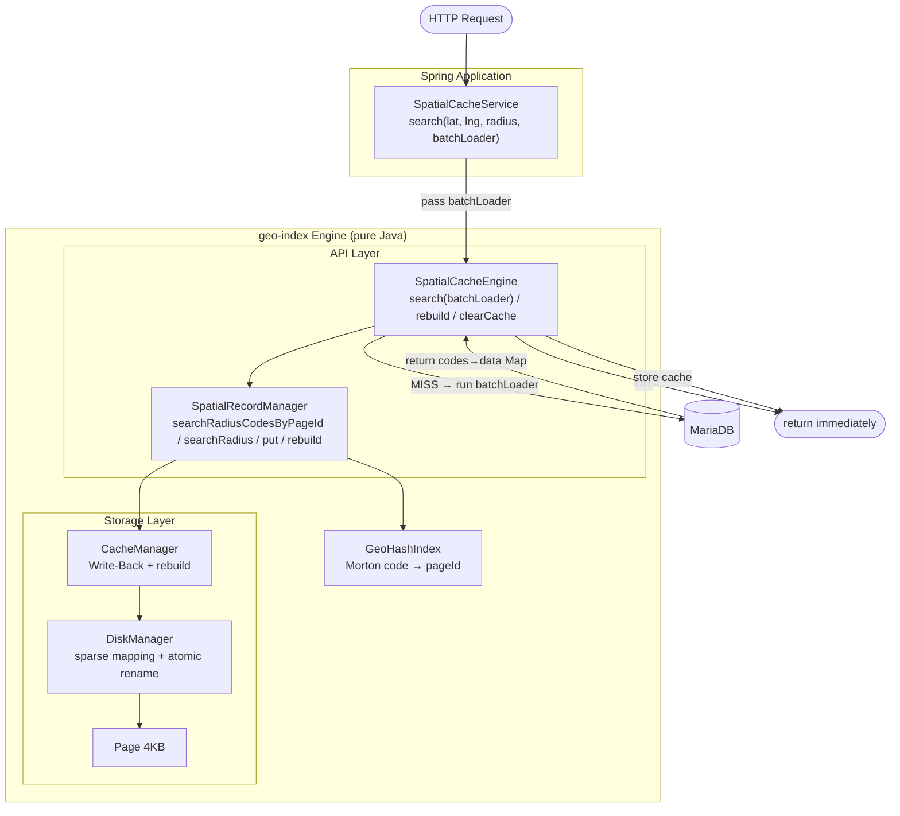

# MiniDB — Disk-Based Spatial Cache Engine

> A spatial index + JVM cache engine built from scratch in **pure Java** —  
> no Redis, no external frameworks, just pages, Morton codes, and 10 concurrency bugs hunted down.

**46.8x faster** on hotspot queries · **0 data loss** under 500 concurrent threads · **79,081** real Korean hospital records tested

[한국어 README](./README.md) | Phase 19 complete | [Spring Integration Guide](#spring-integration-guide)

---

## Why I Built This

While working on a location-based hospital search service, I ran into a wall with radius queries.

```
Attempt 1: MariaDB SPATIAL INDEX (MBRContains)
  → Optimizer chose Full Scan over spatial index in LEFT JOIN context
  → FORCE INDEX: 23,000 scanned / 1,000 returned = 23x wasteful

Attempt 2: Composite index (coordinate_x, coordinate_y)
  → Longitude range selectivity 29% → random I/O cost > Full Scan cost
  → Optimizer abandoned index in JOIN context → Full Scan

Conclusion: DB spatial indexes don't help at 70K rows + JOIN
  → Full Scan + BETWEEN was actually optimal

Attempt 3: Redis Geohash caching
  Reduced DB hits, but introduced new problems:

  Network RTT (measured):
    Cache HIT still costs 60–90ms in network round-trip
    First request after restart: 2,527ms (MISS → background caching → DB fallback)

  Cold start:
    Background caching required on first MISS
    All requests fall back to DB directly until caching completes

  No persistence:
    Redis cache lost on server restart → cold start repeats every deployment

  Domain leak:
    GeoHash grid caching logic bleeds into service layer
    Cache key management, grid range calculation embedded in business code
```

**Root insight**: If the spatial index doesn't work inside the DB, build it outside.

```
Solution: Custom Geohash spatial index engine (MiniDB)
  → GeoHash pageId clustering: "same region = same cache key"
  → Spatial indexing inside JVM — no network round-trips
  → pageId-level JVM cache eliminates DB access on cache hits
  → Up to 46.8x performance gain when combined with JVM cache
```

**Why a standalone pure Java engine?**

Morton code computation, pageId clustering, and page slot structures are complex enough to deserve isolation from Spring business logic.
Spring only needs to know `search() / putCache() / rebuild()`. Internal index implementation can change without touching service code.

---

## Key Insight

> Spatial Index alone may not meaningfully improve DB query performance.
>
> In a real service where MariaDB buffer pool keeps data in memory,
> the query time difference between Full Scan and GeoIndex is small.
>
> But the pageId produced by Spatial Index becomes a cache key:
> **"same region = same pageId"**
>
> Cache at the pageId level, and you can eliminate DB access entirely.
>
> **→ The goal is not to make DB queries faster. It's to skip the DB entirely.**

---

## Architecture



---

## Core Design

### Storage Layer

```
Page (4KB) → DiskManager (sparse mapping table) → CacheManager (Write-Back)

pageId space can be 60 million — actual file size = number of data pages × 4KB
→ Morton codes can be used directly as pageIds
```

### GeoHash Index (Morton Code as pageId)

Four design iterations before the current approach:

```
v1: fixed steps × steps grid → boundary gaps
v2: % MAX_PAGES mapping → % operation destroys spatial locality
v3: Morton SHIFT → Korean coordinate density collapses pageIds to 1–2 clusters
v4: Morton direct pageId + sparse mapping table → 187 pageIds distributed ✅
```

→ Full design history: [GEOHASH_IMPLEMENTATION.md](./geo-index/src/main/java/geoindex/index/GEOHASH_IMPLEMENTATION.md)

### Hilbert Multi-Interval Query

```
① Enumerate grid cells (x, y) within radius
② Each cell → Hilbert value → mark pageId
③ Contiguous pageId ranges → Interval Merge
④ Read only disjoint interval ranges
```

Hilbert curve interval distribution (Gangnam, 5km radius):
```
[3766], [3772~3773], [3775], [3879~3884], [3889~3890]
→ 5 disjoint intervals, only 12 pageId I/Os
```

### JVM Cache + rebuild()

```
First request:
  MiniDB → return pageId list (< 1ms)
  Check pageId cache → MISS
  MariaDB → fetch full data
  Result → putCache() → store in JVM cache

Second request (same radius):
  MiniDB → return pageId list (< 1ms)
  Check pageId cache → HIT
  No MariaDB round-trip → return immediately
```

On batch update:
```java
spatialRecordManager.rebuild(srm ->
    hospitalRepo.findAllCodes().forEach(h ->
        srm.put(h.getLat(), h.getLng(), h.getCode().getBytes())
    )
);
// atomic rename replaces old file + clears JVM cache
// zero request interruption
```

### Cache Warmup

```
Problem: JVM cache resets after restart / rebuild
  → All requests MISS → DB round-trips spike (cold start)

Solution: WarmupStore — persists per-pageId access counts to disk
  During operation  → accumulate pageId hit counts
  On shutdown       → save to warmup.store file
  On restart        → query Top N pageIds from DB → preload JVM cache
                    → first requests can HIT immediately
```

```
Effect:
  3,000 hotspot pageIds warmed up → 16,000 hospital records preloaded
  → Seoul/metro area requests hit immediately without cold start
  → Same warmup runs again after rebuild
```

### Thundering Herd Prevention (Batch Loading Cache)

```
Problem: concurrent MISSes after rebuild → duplicate DB queries for same pageId

Phase 1 — Classify:
  getOrMiss() per pageId → HIT / MISS decision
  MISS pageId: pendingLoads.putIfAbsent(pageId, future)
    → winner: register in toLoad (this thread handles loading)
    → waiter: register in waitFuture (wait for winner result)
  winner double-checks after putIfAbsent:
    re-check HIT → complete future immediately (another thread already put)

Phase 2 — Batch Load:
  flatten + distinct all codes in toLoad → single DB query
  distribute results per pageId → putCache + future.complete

Phase 3 — Collect:
  HIT → directly from hitResults
  winner → myFuture.getNow() (already complete)
  waiter → waitFuture.join() (wait for winner)
```

**Key tradeoff:**
```
With synchronized only:
  Concurrent MISSes → each thread queries DB independently (duplicate queries)
  Correctness guaranteed (last-write-wins)

Batch Load + pendingLoads:
  Duplicate DB queries prevented per pageId
  All MISS codes handled in a single query
  → Bug 10: putIfAbsent requires double-check (details: CONCURRENCY.md)
```

---

## Performance Results

### Dummy Data Benchmark (1,000-run average)

> Conditions: post JVM warm-up, same query 1,000 times, cache cleared before each run

<div align=center>

</div>

- **Full Scan**: Linear growth O(N) with data size
- **GeoHash**: Depends on spatial density O(P) → consistent search performance at scale
- **Hilbert**: Multi-Interval Query reads only the necessary pageIds

### Production Benchmark (79,081 real Korean hospital records)

> Conditions: 5 warm-up runs excluded / alternating execution to eliminate cache bias / 3 scenarios × 100 runs

<div align=center>

</div>

**Why GeoIndex alone is similar to Full Scan:**

```
79,081 rows fit entirely in MariaDB buffer pool → both methods scan memory
IN (1,366 rows) query overhead ≈ BETWEEN range scan cost

→ GeoIndex's real value = providing pageId cache keys, not reducing candidates
```

**Where GeoHash shines — at scale:**

```
100K rows  → Full Scan 528ms  / GeoHash  7ms  →  75x
1M rows    → Full Scan 1177ms / GeoHash  6ms  → 118x

→ Once data exceeds buffer pool, disk I/O gap explodes
```

**Scenario breakdown:**

```
Random  (Worst Case):    fully random coords = no cache reuse → HIT  5.8% →  1.2x
Mixed   (Realistic):     70% hotspot         → HIT 95.9%      → 24.6x
Hotspot (Best Case):     Seoul major areas   → HIT 98.6%      → 46.8x
```

### JMeter Concurrent Benchmark (50 threads, production data)

> Conditions: 50 concurrent JMeter threads / 50 Seoul hotspot coordinates / 3km radius  
> Comparison: Batch Load (`search(batchLoader)`) vs Individual Load (`searchV1`)

```
Batch Load (search with batchLoader):
  Avg response time:  1,490ms
  Throughput:         32.4 req/s

Individual Load (searchV1 — separate DB query per MISS):
  Avg response time:  3,400ms
  Throughput:         14.3 req/s

→ Batch Load ~2.3x faster under concurrent load
```

**Why:**
```
searchV1:
  Concurrent MISSes → separate DB query per pageId
  N MISSes → N DB round-trips (connection pool contention)

Batch Load:
  All MISS codes → single IN query (1 connection)
  pendingLoads → prevents duplicate queries for same pageId
  → Minimized DB connection contention + fewer queries
```

---

## Production Integration

MiniDB does not support transactions or distributed coordination. It is designed as a **spatial filter + JVM cache layer**, not a primary database replacement.

```
[Request]
  ↓
[MiniDB] compute pageId list (< 1ms)
  ↓
[SpatialCacheService] check pageId cache
  ├─ HIT → return immediately (no MariaDB round-trip)
  └─ MISS → [MariaDB] WHERE hospital_code IN (...) + JOIN
              → cache result per pageId
```

**Operations strategy:**
```
Hospital data: large batch update once a week
→ Full MiniDB rebuild weekly (no deletes needed)
→ Serve from old file during rebuild (atomic rename)
→ File swap + JVM cache auto-clear on completion
```

---

## Spring Integration Guide

This engine has no domain-specific dependencies. Any location data with **latitude, longitude, and a unique code (String)** — hospitals, pharmacies, convenience stores, restaurants — works the same way.

```
What the engine requires:
  put()    → lat (double), lng (double), code (String)
  search() → lat, lng, radiusKm → List<T>  (T is determined by your service)
```

### Step 1: Build the Engine

Run inside the **`geo-index` submodule**, not the root directory.

```bash
cd geo-index
mvn install
```

### Step 2: Add Dependency

```xml
<dependency>
    <groupId>com.geoindex</groupId>
    <artifactId>geo-index</artifactId>
    <version>1.0.0</version>
</dependency>
```

### Step 3: GeoIndexConfig — Register Beans

`GeoIndexEngine.builder()` handles assembly of all 7 internal components (EngineMetrics, DiskManager, CacheManager, GeoHashIndex, SpatialRecordManager, WarmupStore, SpatialCacheEngine) in one line.

Key notes:
- **`destroyMethod = "close"` is required** — flushes dirty pages, closes files, and persists warmup hit counts on Spring shutdown
- **`warmupFile` is required** — omitting it throws `IllegalStateException`
- Multiple beans of the same type require **`@Qualifier`**

```java
@Configuration
public class GeoIndexConfig {

    @Bean(name = "placeASpatialCacheEngine", destroyMethod = "close")
    public SpatialCacheEngine<PlaceADto> placeASpatialCacheEngine() {
        return GeoIndexEngine.<PlaceADto>builder()
                .dbFile("place-a.db")
                .warmupFile("place-a-warmup.store")
                .build();
    }

    @Bean(name = "placeBSpatialCacheEngine", destroyMethod = "close")
    public SpatialCacheEngine<PlaceBDto> placeBSpatialCacheEngine() {
        return GeoIndexEngine.<PlaceBDto>builder()
                .dbFile("place-b.db")
                .warmupFile("place-b-warmup.store")
                .build();
    }
}
```

### Step 4: application.properties

```properties
# Top N pageIds to warm up (hotspot pages by hit count)
cache.warmup.size=3000

# CachePolicy customization (optional — defaults: TTL disabled, size unlimited)
# cache.ttl.days=0     # 0 = disabled. Use clearCache() on batch cycle instead
# cache.max-size=-1    # -1 = unlimited
```

### Step 5: Service Class

Extend `AbstractSpatialCacheEngine<T>` to get search / warmup / rebuild / shutdown logic for free.

Your service needs two repositories:
- **For IN queries**: `WHERE code IN (...)` — batch load on MISS
- **For full scan**: `findAll()` — full re-index on rebuild

You only implement 5 methods:

| Method | Role |
|--------|------|
| `loadByCodes(codes)` | codes → DB IN query → return `Map<String, T>` |
| `getCode(item)` | Extract unique code from T |
| `getLat(item)` | Extract latitude from T |
| `getLng(item)` | Extract longitude from T |
| `isValid(item)` | Null-check coordinates (default `true` — override if needed) |

```java
@Slf4j
@Service
public class PlaceSpatialCacheService extends AbstractSpatialCacheEngine<PlaceDto> {

    private final PlaceJdbcRepository jdbcRepository;  // for IN queries
    private final PlaceRepository repository;          // for full scan (rebuild)
    private final Executor taskExecutor;

    public PlaceSpatialCacheService(
            @Qualifier("placeASpatialCacheEngine") SpatialCacheEngine<PlaceDto> spatialCacheEngine,
            PlaceJdbcRepository jdbcRepository,
            PlaceRepository repository,
            Executor taskExecutor) {
        super(spatialCacheEngine);
        this.jdbcRepository = jdbcRepository;
        this.repository     = repository;
        this.taskExecutor   = taskExecutor;
    }

    @Override
    protected Map<String, PlaceDto> loadByCodes(List<String> codes) {
        return jdbcRepository.findByCodes(codes).stream()
                .collect(Collectors.toMap(PlaceDto::getCode, p -> p));
    }

    @Override protected String getCode(PlaceDto p) { return p.getCode(); }
    @Override protected double getLat(PlaceDto p)  { return p.getLat(); }
    @Override protected double getLng(PlaceDto p)  { return p.getLng(); }

    @Override
    protected boolean isValid(PlaceDto p) {
        return p.getLat() != null && p.getLng() != null;
    }

    // ① Build / periodic rebuild — atomic rename, no service interruption
    public void buildIndex() {
        spatialCacheEngine.rebuild(srm ->
            repository.findAll().forEach(p -> {
                if (p.getLat() != null && p.getLng() != null)
                    srm.put(p.getLat(), p.getLng(), p.getCode().getBytes());
            })
        );
        CompletableFuture.runAsync(this::warmup, taskExecutor);
    }

    // ② Async warmup on server start — search() is provided by parent
    @PostConstruct
    public void init() {
        CompletableFuture.runAsync(this::warmup, taskExecutor);
    }

    // ③ Persist hit history on shutdown → restored by warmup() on next restart
    @PreDestroy
    public void destroy() { shutdown(); }

    public MetricsSnapshot getMetric() { return getMetrics(); }
}
```

**What the parent provides:**
- `search(lat, lng, radiusKm)` — includes batchLoader + MBR post-filter
- `warmup()` — WarmupStore Top N pageIds → chunked DB IN queries → putCache
- `shutdown()` — calls `persistWarmup()`
- `getMetrics()` — metrics snapshot across all layers

### Step 6: Prometheus / Grafana Integration (Optional)

With separate `EngineMetrics` per domain, each engine's metrics can be tracked independently via the `type` tag. Adding a new domain only requires one more `register()` call.

```java
@Component
public class GeoIndexMetricsExporter {

    private final Map<String, SpatialCacheEngine<?>> engines;
    private final MeterRegistry meterRegistry;

    public GeoIndexMetricsExporter(
            @Qualifier("placeASpatialCacheEngine") SpatialCacheEngine<?> placeAEngine,
            @Qualifier("placeBSpatialCacheEngine") SpatialCacheEngine<?> placeBEngine,
            MeterRegistry meterRegistry) {
        this.engines = Map.of("place-a", placeAEngine, "place-b", placeBEngine);
        this.meterRegistry = meterRegistry;
    }

    @PostConstruct
    public void registerMetrics() {
        engines.forEach(this::register);
    }

    private void register(String type, SpatialCacheEngine<?> engine) {
        List<Tag> tags = List.of(Tag.of("type", type));
        meterRegistry.gauge("geoindex.index.queryCount",         tags, engine, e -> e.getMetrics().queryCount);
        meterRegistry.gauge("geoindex.cache.hit",                tags, engine, e -> e.getMetrics().pageHit);
        meterRegistry.gauge("geoindex.cache.miss",               tags, engine, e -> e.getMetrics().pageMiss);
        meterRegistry.gauge("geoindex.cache.hitRate",            tags, engine, e -> e.getMetrics().pageHitRate);
        meterRegistry.gauge("geoindex.cache.size",               tags, engine, e -> e.getMetrics().cacheSize);
        meterRegistry.gauge("geoindex.disk.pageRead",            tags, engine, e -> e.getMetrics().pageReadCount);
        meterRegistry.gauge("geoindex.disk.pageWrite",           tags, engine, e -> e.getMetrics().pageWriteCount);
        meterRegistry.gauge("geoindex.storage.overflowPageUsed", tags, engine, e -> e.getMetrics().overflowPageUsed);
    }
}
```

### API Reference

Spring only needs to know these methods. Internal index implementation can change without touching service code.

| Method | Purpose |
|--------|---------|
| `search(lat, lng, radiusKm, batchLoader)` | Radius search — batch DB query on MISS → cache → return **(recommended)** |
| `search(lat, lng, radiusKm)` | Radius search — HIT/MISS only, DB query is caller's responsibility |
| `putCache(pageId, data)` | Store DB result in JVM cache at pageId level after MISS |
| `rebuild(loader)` | Full re-index via atomic rename — no service interruption, clears JVM cache on complete |
| `getWarmupTargets(n)` | Return Top N pageIds + codes by hit count (for warmup) |
| `persistWarmup()` | Save hit counts to disk — call from `@PreDestroy` |
| `getMetrics()` | Get metrics snapshot across all layers (queryCount, hitRate, pageReadCount, etc.) |

All performance figures above were measured against this integration using 79,081 real Korean hospital records.

---

## Concurrency — 10 Bugs Fixed

### Why concurrency is critical for this engine

```
Typical cache:
  Wrong cache entry → auto-recovered after TTL expiry ✅

This engine:
  put() → compute pageId → write permanently to Page
  One wrong Page write = wrong results forever until rebuild()
  Data correctness = non-negotiable
```

### Bugs Fixed (Bug 1–10)

10 concurrency bugs found and fixed. The core lesson: **upper-layer locks do not guarantee thread-safety in lower layers.**

```
SpatialRecordManager (Page-level lock ✅)
        ↓
  CacheManager        (flush sync missing ❌ → Bug 8)
        ↓
  DiskManager         (RandomAccessFile sync missing ❌ → Bug 5, 6)
```


### Verification Method — `/compare` Endpoint

Concurrency bugs don't reproduce on a single thread. Verified with:

```
GET /loadtest/compare?lat=&lng=&radius=

Same coordinates → FullScan / GeoIndex called concurrently
→ Compare results as hospital_code Sets
→ Log missing count

1 thread   → If reproduced: logic bug
500 threads → If reproduced: concurrency bug confirmed
```

### Verification Results (500 concurrent threads)

```
Before fix:
  FullScan 5,040 | GeoIndex 4,610 | Missing: 430 ❌

After fix:
  FullScan: 6,460 | GeoIndex: 6,460 | Missing: 0 ✅
  100 comparisons → 0 missing from concurrency ✅
```

→ Details: [CONCURRENCY_EN.md](.docs/CONCURRENCY_EN.md)

---

## Design Scope & Limitations

This engine is designed for **single-node workloads**.

| Limitation | Detail |
|------------|--------|
| **Cache inconsistency** | JVM cache is node-local — multiple servers will have different cache states |
| **No rebuild propagation** | `rebuild()` only replaces file and cache on the executing node — other nodes are not notified |
| **Thundering Herd (cross-node)** | Concurrent MISSes across nodes each query DB independently — single-node `pendingLoads` does not help |

> Cross-node coordination should be handled at the infrastructure layer (load balancer strategy, external cache, etc.).

---

## Module Structure

```
geo-index/
  storage/
    Page.java               4KB page unit
    DiskManager.java        sparse mapping table + atomic rename rebuild
    PageLayout.java         slot page structure (absolute position read/write)
  buffer/
    CacheManager.java       Write-Back cache + rebuild + computeIfAbsent
  api/
    GeoIndexEngine.java              Builder factory — assembles all 7 components in one line
    AbstractSpatialCacheEngine.java  Template method — search/warmup/rebuild/shutdown shared logic
    SpatialCacheEngine.java          Top-level API — JVM cache (getOrMiss / put / clearCache)
    SpatialRecordManager.java        File search / store / rebuild
    PageResult.java                  Cache lookup result value object
    RecordId.java                    Physical record location value object (pageId + slotId)
    RecordManager.java               Key-Value storage
  cache/
    PageCacheStore.java         LinkedHashMap LRU-based cache infrastructure
    CachePolicy.java            TTL / maxSize policy
    CacheEntry.java             Cache value wrapper (data + expiry time)
    WarmupStore.java            Per-pageId access count tracking + disk persistence
  metric/
    EngineMetrics.java          AtomicLong counter store (shared across all layers)
    MetricsSnapshot.java        Immutable point-in-time metrics DTO
  index/
    SpatialIndex.java       Interface
    GeoHash.java            Morton code encoding (toMorton / interleave)
    GeoHashIndex.java       Morton direct pageId mapping
    HilbertCurve.java       Hilbert curve computation
    HilbertIndex.java       Multi-Interval Query implementation
    HilbertIndexDebug.java  Hilbert index debug utility
  benchmark/
    FullScanBenchmark.java
    GeoHashBenchmark.java
    HilbertBenchmark.java
    BenchmarkRunner.java
  util/
    GeoUtils.java           Haversine distance calculation
```

---

## Tech Stack

| Item | Detail |
|------|--------|
| **Language** | Java 21 |
| **Storage** | RandomAccessFile (page-based) |
| **Dependencies** | None (pure Java, no frameworks) |
| **Testing** | JUnit 5 |
| **Dataset** | 79,081 real Korean hospital records |
| **Visualization** | Python (folium, matplotlib) |

---

## Roadmap

<details>
<summary>Show all phases</summary>

```
✅ Phase 1:  Storage (Page, DiskManager, CacheManager)
✅ Phase 2:  API (RecordManager, PageLayout)
✅ Phase 3:  GeoHash (GeoHash, GeoHashIndex, SpatialRecordManager)
✅ Phase 4:  Benchmark (Full Scan vs GeoHash vs Hilbert)
✅ Phase 5:  Hilbert Multi-Interval Query + Seek Count comparison
✅ Phase 6:  DiskManager sparse mapping table
✅ Phase 7:  Morton direct pageId mapping (187 distributed pageIds)
✅ Phase 8:  Real hospital data integration + A/B benchmark (50-run avg)
✅ Phase 9:  SpatialCacheService (JVM cache) + 3-scenario benchmark
             - Map<pageId, List<HospitalData>> lazy cache
             - Full pageId storage + MBR filtering (no gaps/excess)
             - Random / Mixed / Hotspot 100-run measurement
             - Mixed 24.6x / Hotspot 46.8x improvement confirmed
✅ Phase 10: Cache operations hardening
             - CachePolicy (TTL / maxSize), CacheEntry (expiry wrapper)
             - SpatialCacheEngine refactor (removed SpatialRecordManager dependency)
             - SpatialRecordManager top-level API consolidation
             - Atomic rename-based zero-downtime rebuild
✅ Phase 11: Concurrency fix (Bug 1–4)
             - ByteBuffer position() → absolute position methods (fixes BufferUnderflowException)
             - CacheManager.getPage() → computeIfAbsent (prevents duplicate Page creation)
             - writeWithOverflow() / readAllCodesFromChain() → ReentrantReadWriteLock
             - overflowFreeList → ConcurrentLinkedDeque (prevents duplicate pageId allocation)
             - 500-thread verification: 0 missing records from concurrency ✅
✅ Phase 12: GeoHash boundary overflow fix
             - getPageIds() maxLatBits/maxLngBits → Math.min((1L<<15)-1, ...) clamping
             - Prevents page gaps near polar coordinates
✅ Phase 13: Lower-layer concurrency fix (Bug 5–9)
             - DiskManager.readPage() / writePage() → synchronized
             - Page.dirty → volatile (cross-thread visibility)
             - CacheManager.flush() → synchronized(page)
             - PageCacheStore ConcurrentHashMap → LinkedHashMap + synchronized (LRU eviction)
             - DiskManager.rebuild() failure: delete temp file + reopen original
             - 500-thread verification: 0 data loss ✅
✅ Phase 14: Engine metrics system
             - EngineMetrics — AtomicLong counters + Supplier real-time queries
             - MetricsSnapshot — immutable point-in-time value object
             - Per-layer counter injection
             - GeoIndexMetricsExporter — Micrometer Gauge → Prometheus / Grafana
✅ Phase 15: Cache warmup
             - WarmupStore — per-pageId hit count tracking
             - persist() / load() — hit count disk persistence across restarts
             - getTopPageIds(n) — Top N by hit count descending
             - IN query chunking (1,000 rows) to avoid DB connection timeout
✅ Phase 16: usedPageCount metric
             - DiskManager.getUsedPageCount() — pageMap.size()
             - Exposed via CacheManager / SpatialRecordManager
✅ Phase 17: Batch Loading Cache + Thundering Herd prevention
             - search(batchLoader) — collect all MISS codes → single batch DB query
             - pendingLoads ConcurrentHashMap — prevents duplicate loading per pageId
             - putIfAbsent + double-check — race condition fix (Bug 10)
             - JMeter 50-thread benchmark: ~2.3x improvement (3,400ms → 1,490ms)
✅ Phase 18: Pharmacy data index integration
             - Pharmacy code + coordinates → pharmacy.db index (same structure as hospitals)
             - Separate SpatialCacheEngine<PharmacyDto> instance (pageId space naturally isolated)
✅ Phase 19: Spring integration simplification
             - GeoIndexEngine.builder() — assembles all 7 components in one line (factory pattern)
             - AbstractSpatialCacheEngine<T> — search/warmup/rebuild/shutdown shared logic (template method)
             - Services implement only 5 methods: loadByCodes / getCode / getLat / getLng / isValid
             - GeoIndexConfig reduced from 94 lines → 30 lines / 90% service boilerplate eliminated
             - SpatialCacheEngine.close() chain centralizes resource cleanup
```

</details>

---

## License

MIT
