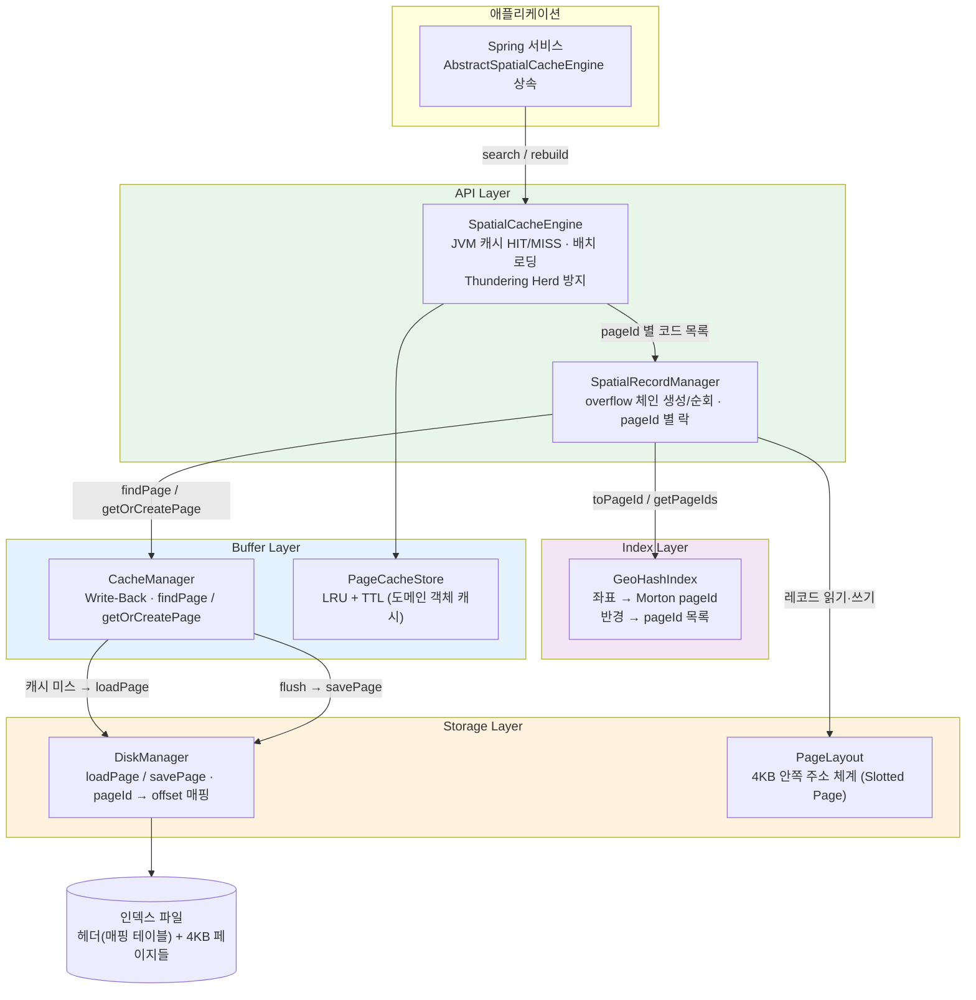
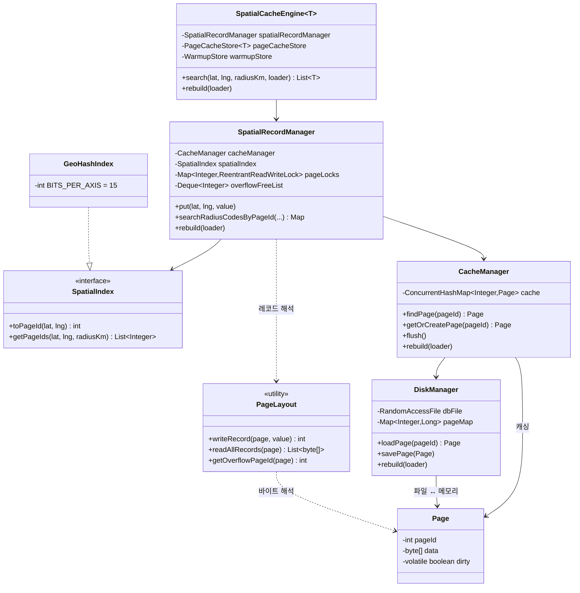
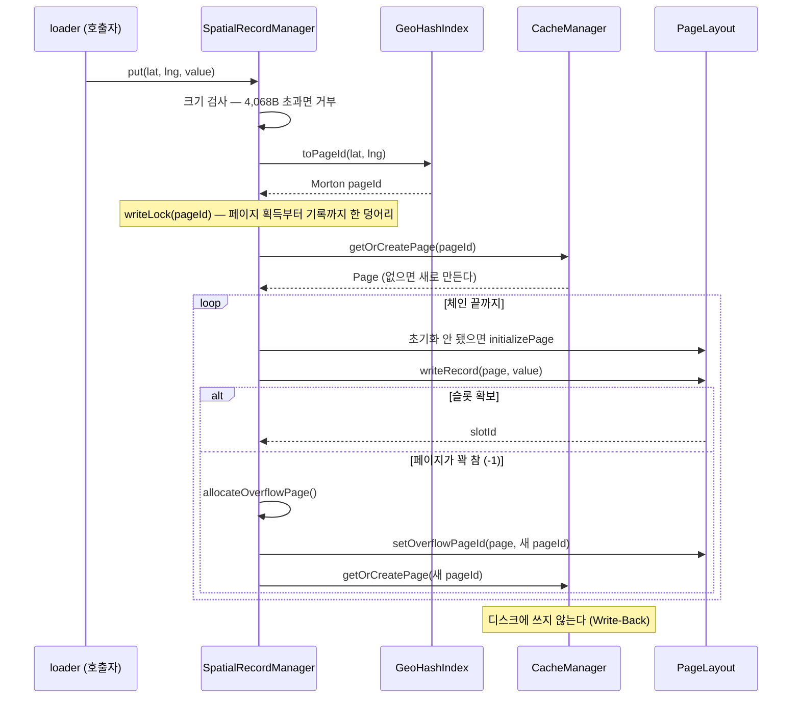
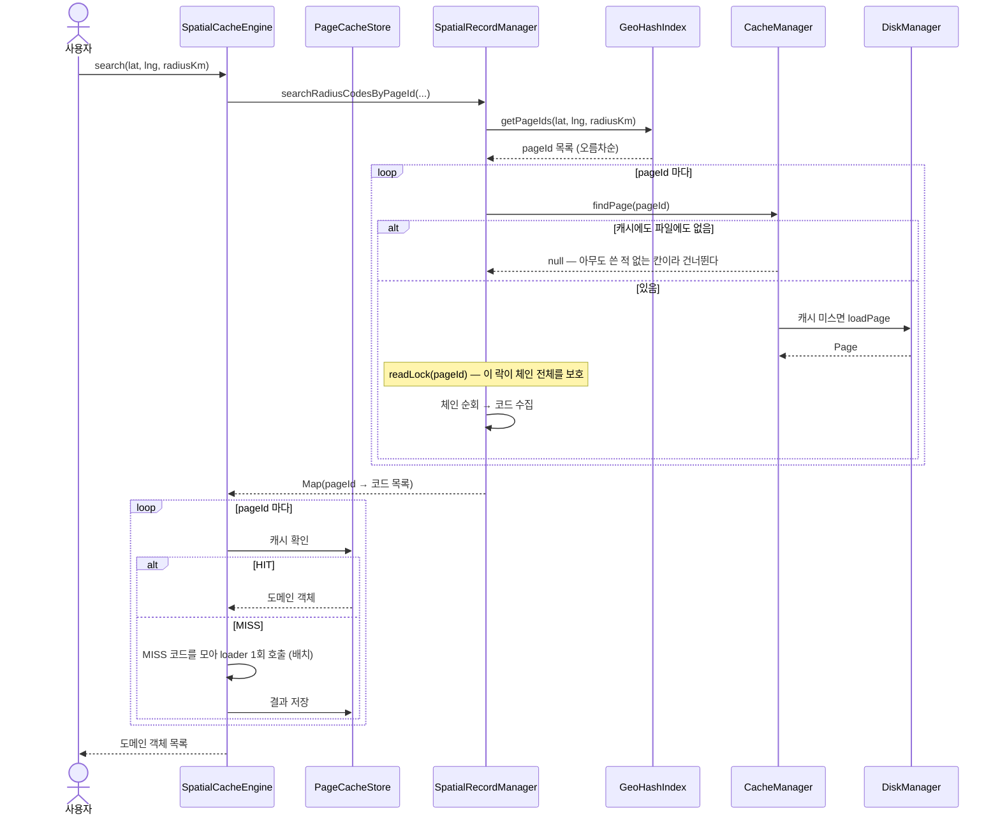
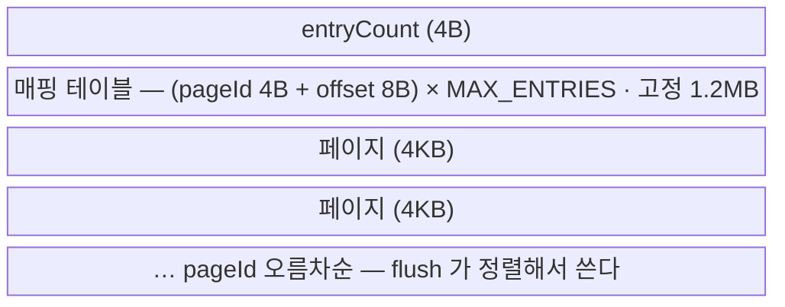
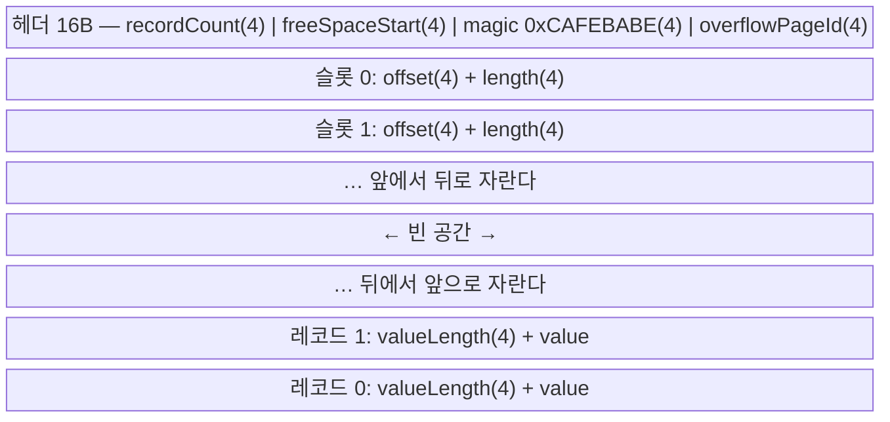
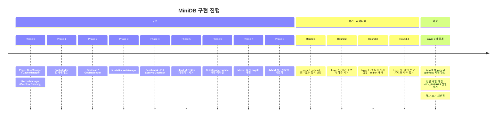

# MiniDB 아키텍처 다이어그램

## 레이어 구조

캐시가 두 종류다.

| | 담는 것 | 위치 | 정책 |
|---|---|---|---|
| `CacheManager` | 4KB **페이지** | Buffer Layer | evict 없음, rebuild 때만 비움 |
| `PageCacheStore` | 도메인 **객체**(병원) | API Layer | LRU + TTL |

MiniDB 는 병원 **코드**만 돌려준다. 실제 데이터는 서비스가 MariaDB 에서 가져와
`PageCacheStore` 에 담는다. 그래서 인덱스 파일이 손상돼도 원본은 멀쩡하다 —
`CorruptedIndexException` 을 던지고 부분 결과를 반환하지 않는 근거가 이것이다.

---

## 클래스 의존성

`SpatialRecordManager` 는 `SpatialCacheEngine` 을 모른다. 의존이 한 방향이다.

---

## 데이터 흐름: put — rebuild 안에서만 실행된다

`put` 은 `public` 이지만 운영에서 부르는 곳은 `rebuild` 안의 로더 하나뿐이다.
디스크 기록은 마지막 `flush` 에서 pageId 오름차순으로 한 번에 일어난다.

---

## 데이터 흐름: search

조회는 좌표에서 pageId 를 얻지 않는다. `getPageIds` 가 반경을 덮는 격자를
**기하학적으로 열거**하므로 저장된 데이터와 무관한 칸 번호가 섞이고,
그래서 `findPage` 가 `null` 을 돌려주는 것이 정상 경로다.

---

## 파일 배치

pageId 가 Morton 코드라 `offset = pageId × 4096` 으로 계산하면 파일이 TB 급이 된다.
그래서 위치를 **계산하지 않고 조회**한다. 파일 크기가 실제로 쓴 페이지 수에만 비례하는 대신,
매핑 테이블을 메모리에 들고 있어야 하고 페이지 수 상한(`MAX_ENTRIES`)이 생긴다.

---

## Page 내부 구조

레코드에 **key 를 저장하지 않는다.** 공간 인덱스에서는 pageId 자체가 "어느 격자냐"라는
키이므로 페이지 안에서 키를 다시 비교할 이유가 없고, 읽기는 슬롯 순회로 전량 반환한다.

슬롯과 레코드가 반대 방향으로 자라는 덕에 빈 공간이 항상 가운데 한 덩어리로 모여,
남은 공간 판정이 뺄셈 한 번으로 끝난다.

---

## 구현 이력

